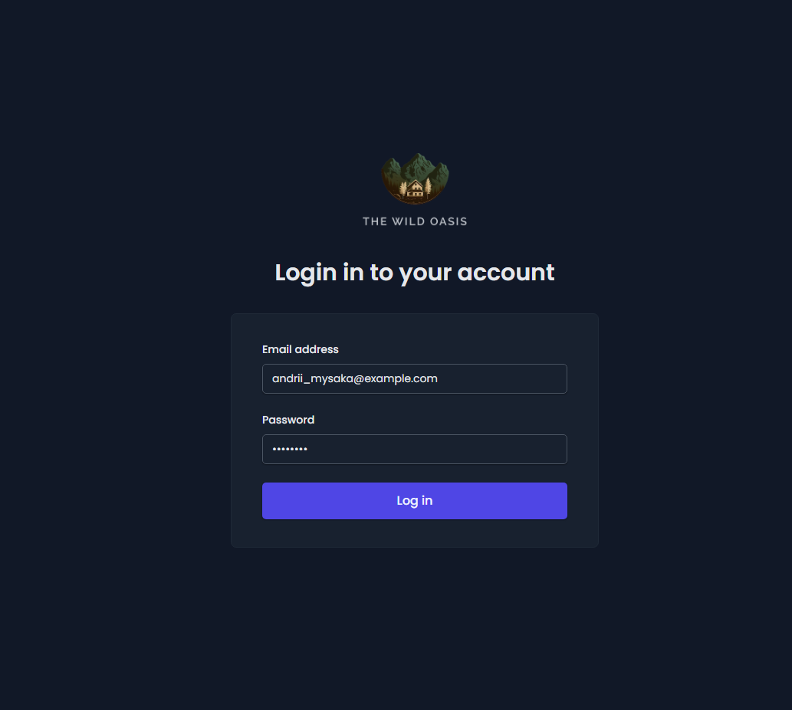
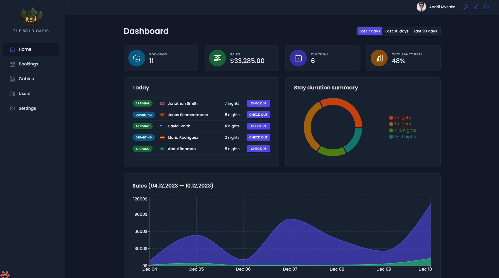
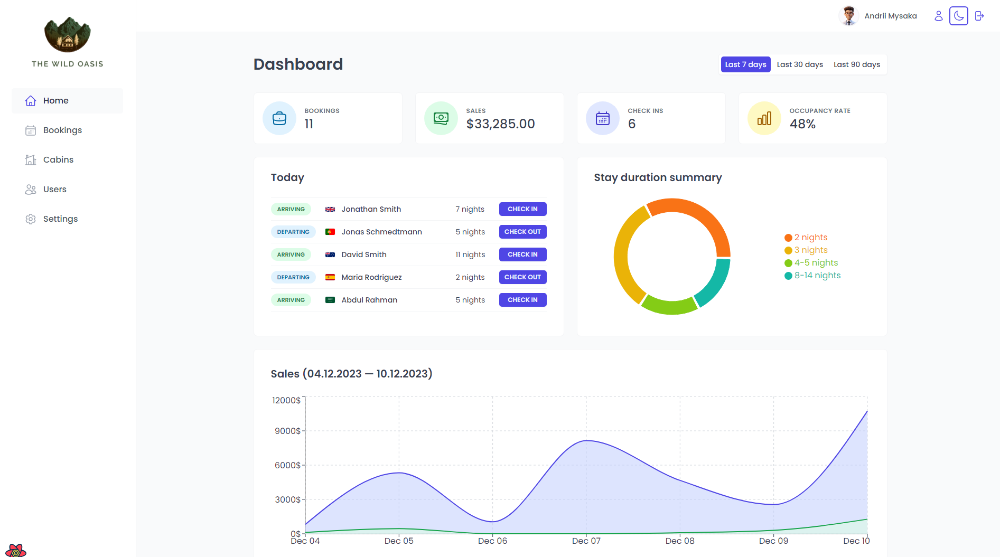
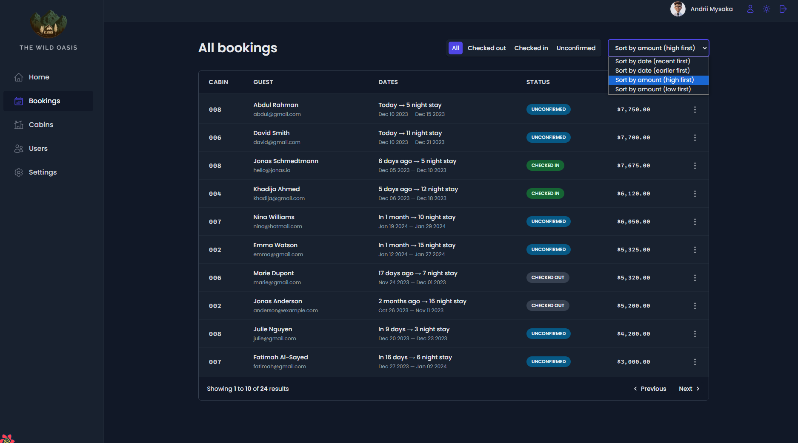
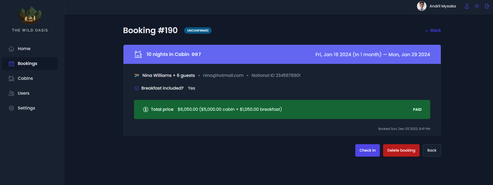
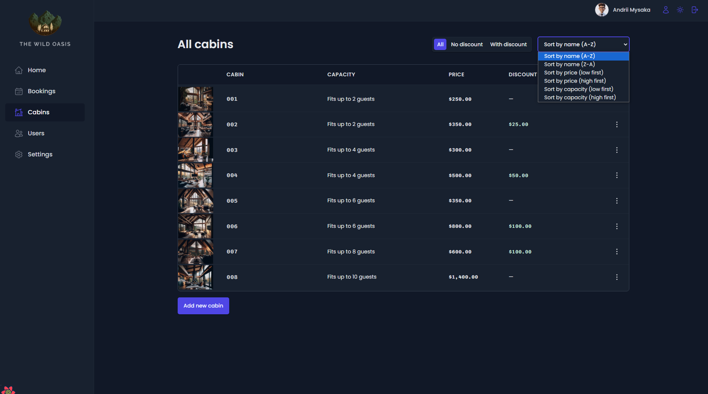
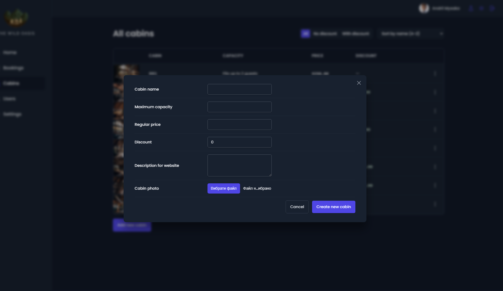
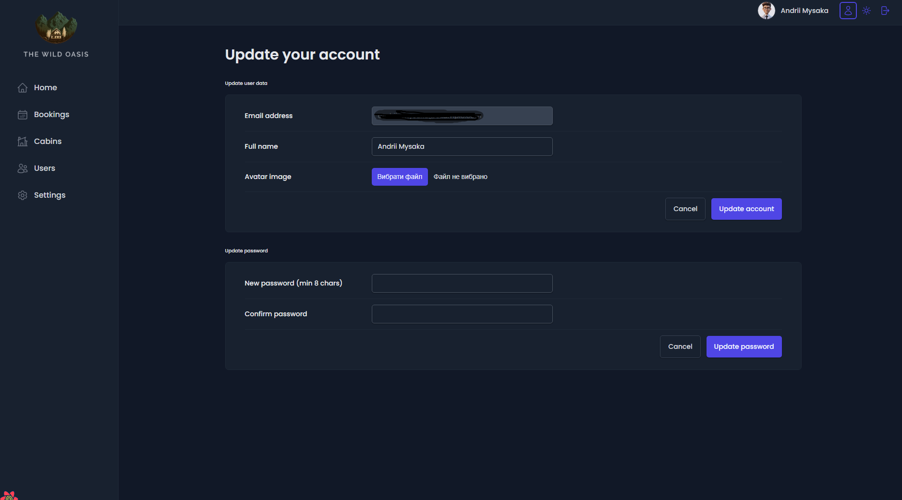
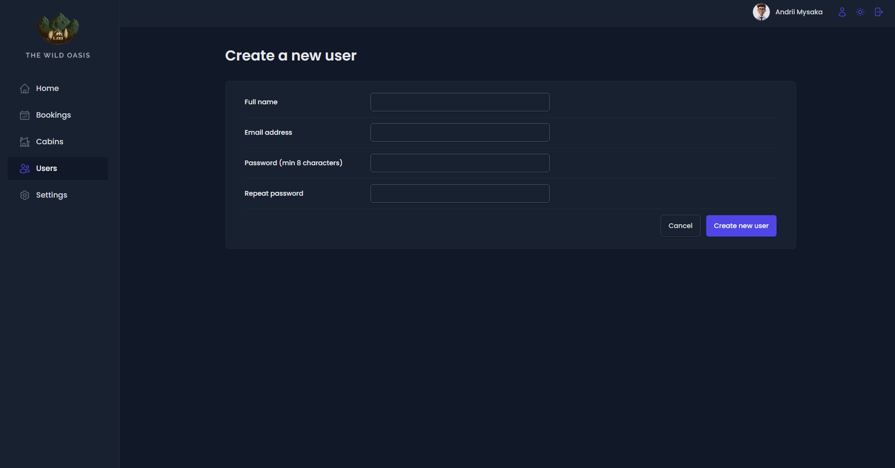

# <a href="https://the-wild-oasis-andrii-mysaka.netlify.app/" target="_blank">The Wild Oasis</a>

Welcome to The Wild Oasis Hotel Management Application documentation. The Wild Oasis is a user friendly hotel management application. This application is designed to manage hotel operations, including sales statistics, cabin management, user management, booking management, and various customization options. It integrates authentication, database storage, and dark mode features. And so much more!

The purpose of this project is to implement my advanced <b>Javascript</b>,<strong>Typescript</strong> and <strong>Database Query</strong> skills in a web application and bring it to reality. Moreover, further enhance my knowledge of <strong>ReactJs</strong>.

I believe the best approach to learning something new is <strong>"Learning by Doing"</strong>.

## Key Features 📝

-   Authentication and Authorization

    -   Users of the app are hotel employees. They can logged in into the application to perform tasks.
    -   New users can only be signed up inside the applications (to guarantee that only actual hotel employees can get accounts).
    -   Users able to upload an avatar, and change their name and password

-   Cabins

    -   The app has a table view with all cabins, showing the cabin photo, name, capacity, price, and current discount.
    -   Users able to update or delete a cabin, and create new cabins (including uploading a photo)

-   Bookings

    -   The app has a table view with all bookings, showing arrival and departure dates, status, and paid amount, as well as cabin and guest data.
    -   The booking status can "unconfirmed" (booked but not yet checked in), "checked in", or "checked out". The table filterable by this important status.
    -   Other booking data includes: the number of guests, number of nights, guest observations, whether they booked breakfast, breakfast price.

-   Check In/Out

    -   Users able to delete, check-in, or check out a booking as the guest arrives (no editing necessary for now).
    -   Bookings may not have been paid yet on guest arrival. Therefore, on check-in, users need to accept payment (outside the app), and then confirm that payment has been received (inside the app).
    -   On check-in, the guest should have the ability to add breakfast for the entire stay, if they hadn't already.

-   Guests

    -   Guest data contain full name, email, national ID, nationality, and a country flag for easy identification.

-   Dashboard

    -   The initial app screen should be a dashboard, to display important information for the last 7, 30, or 90 days:
        -   A list of guests checking in and out on the current day. Users should be able to perform these tasks from here.
        -   Statistics on recent bookings, sales, check-ins, and occupancy rate.
        -   A chart showing all daily hotel sales, showing both "total" sales and "extras" sales (only breakfast at the moment).
        -   A chart showing statistics on stay durations, as this is an important metric for the hotel

-   Settings

    -   Users able to define a few application-wide settings: breakfast price, min and max nights/booking, max guests/booking

-   App dark mode.

## Demonstration 🖥️

#### Login Page

#### Dashboard Page (Light / Dark Theme)

#### Bookings Details

#### Cabins Details

#### Users Profile Update Page

#### Create new user Page

## 💻 Technology Used

The Wild Oasis Hotel Management Application is built using the following technologies and libraries:

-   **React**: JavaScript library for UI development.

-   **Supabase**: Cloud database service for real-time and secure data storage.

-   **@tanstack/react-query**: Data-fetching and state management library for React.

-   **date-fns**: JavaScript date utility library for parsing, formatting, and manipulating dates.

-   **react-router-dom**: Library for routing and navigation in React apps.

-   **recharts**: Composable charting library for React.

-   **styled-components**: CSS-in-JS library for styling React components.

-   **react-hot-toast**: Customizable toast notification library for React.

-   **react-icons**: Collection of customizable icons for React apps.

-   **react-hook-form**: Library for form state management and validation in React.

